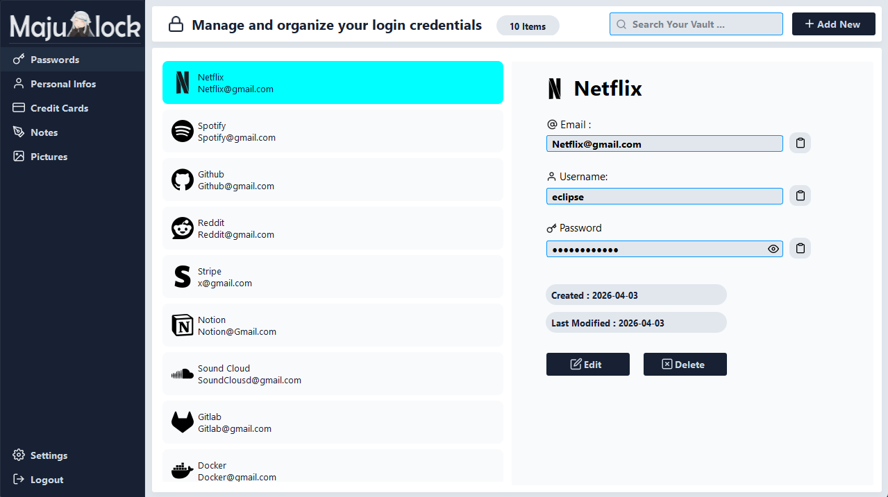
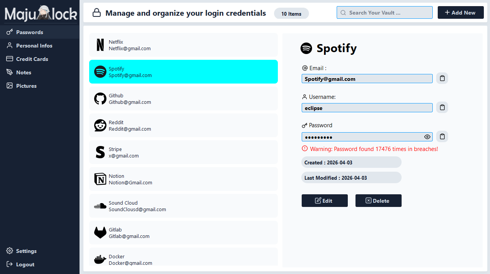

# Majulock

Majulock is a secure, local desktop password manager built with C++ and the Qt framework. It allows users to safely store and manage their digital identities, including passwords, credit cards, and personal information, directly on their machine using an SQLite database. 

<p align="center">
  
  
</p>

## Features

- Local Data Storage: All passwords and secrets are stored locally in an SQLite database (Majulock.db).
- Password Generator: Built-in tool to generate strong, secure passwords on the fly.
- Pwned Password Checker: Integrated network check against the "Have I Been Pwned" database to ensure your passwords haven't been compromised in known data breaches.
- Quick Copy: Easily copy your email, username, or password to the clipboard with a single click.
- Detail Management: Keep track of not just passwords, but also personal information and credit card details.
- Cross-Platform Compatibility: Designed using Qt, supporting cross-platform builds and compatible with both Qt 5 and Qt 6.

## Installation 

### Pre-compiled Releases

You can download the latest pre-compiled binaries for your operating system directly from the **Releases** page on the GitHub repository. 
Just download the executable archive, extract it, and run the application.

### Building from Source

If you prefer to build the application from source, you will need a C++ compiler and the Qt framework installed.

**Prerequisites:**
- C++17 compliant compiler
- CMake 3.16 or higher
- Qt 5 or Qt 6 (Core, Gui, Widgets, Sql, Svg, Network modules)

**Build Instructions:**

1. Clone the repository to your local machine.
2. Create a build directory and navigate to it:
   ```bash
   mkdir build
   cd build
   ```
3. Configure the project with CMake:
   ```bash
   cmake ..
   ```
4. Build the executable:
   ```bash
   cmake --build .
   ```
5. Run the compiled Majulock application.

## Technologies Used

- C++17
- Qt Framework (Widgets, Sql, Svg, Network)
- CMake
- SQLite

## License

Distributed under the MIT License. See `LICENSE` for more information.

[](https://opensource.org/licenses/MIT)
